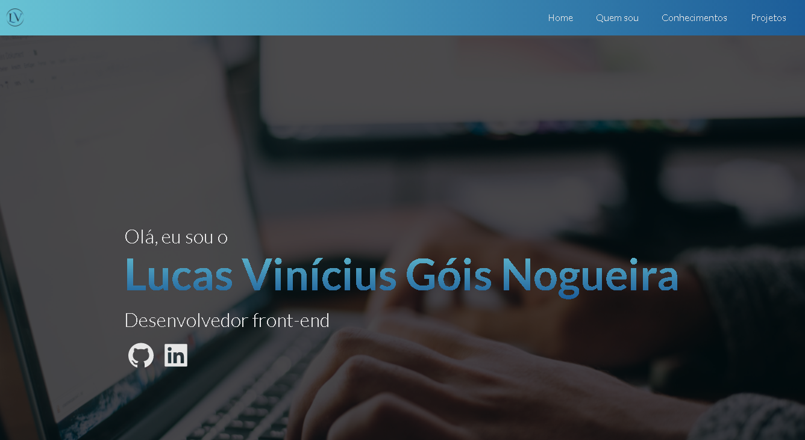

## Porfólio

<h1 align="center">
  
</h1>

## Portfólio para divulgação de projetos e conhecimentos

### 🛠 Tecnologias utilizadas
- [React](https://pt-br.reactjs.org/)
- [ReactIcons](http://react-icons.github.io/react-icons/)
- [TypeScript](https://www.typescriptlang.org/)

### Features
- [x] Menu Responsivo
- [x] Redes sociais
- [ ] Formulário de contato
- [ ] Sessão de projetos responsiva
- [ ] Animações no menu e conteúdo